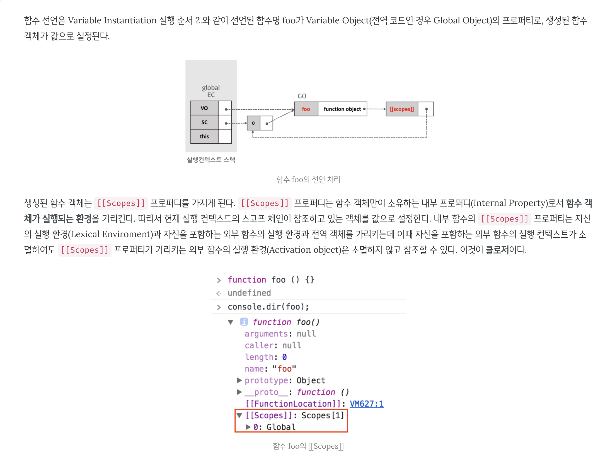

# 01. 함수형 자바스크립트 소개

### 정리

- 일급함수, 클로저, 고차 함수, 콜백 함수, 부분 적용에 대해서 알기!
    - 고차함수
        - 함수를 인자로 받거나, 함수를 리턴하는 함수를 '고차함수' 라고 한다.
        - 보통 고차함수는 '함수'를 인자로 받아 필요한때 실행하거나, 클로저를 만들어 리턴한다.
    - 일급함수
        - 자바스크립트에서, 함수는 일급 객체 이면서 동시에 일급함수 이다.
        - 자바스크립트에서, 개체는 일급 객체 이다.
        - '일급'
            - 값으로 다룰 수 있다는 의미
            - 변수에 담을 수 있다
            - 함수나 메소드에 인자로 넘길 수 있다
            - 함수나 메소드에서 리턴 할 수 있다
        - '일급 함수'
            - 아무때나(런터임에서도) 선언 가능
            - 익명 선언 가능
            - 익명 선언 함수도 함수나 메소드의 인자로 넘길 수 있음

    - 클로저
        - '클로저는 자신이 생성될 때의 scope에서 알 수 있었던 변수를 기억 하는 함수다'
    - 부분적용

        bind, curry, partial

- 함수를 아무때나 정의 하고 사용해보자!

### 함수형 프로그래밍?

- 부수 효과를 멀리하고 '조합성' 을 강조한 프로그래밍 "패러다임"
    - 오류를 줄이고, '조합성', '모듈화' 하기

### **가장 기본적인 함수형 프로그래밍 예제**

- 코드

    ```jsx
    function addMaker(a) {
      return function(b) {
        return a + b;
      }
    }

    addMaker(10)(5); // 15

    const add5 = addMaker(5);
    // add5는 function(b) { return 5 + b }; 와 같음
    add5(3); // 8
    add5(4); // 9

    // 함수도 값으로 사용 될 수 있다.
    // 함수는 함수를 리턴 할 수 있다.
    ```

### **값으로써의 함수 & 클로저**

- addMaker에서 'a'는 부모 scope에서 결정된다.
- 한번 결정된 'a'는 "불변"하며 상수화 된다.

### **함수형 자바스크립트의 실용성**

- 코드

    ```jsx
    const users = [
      { id: 1, name: '일', age: 32 },
      { id: 2, name: '이', age: 25 },
      { id: 3, name: '삼', age: 32 },
      { id: 4, name: '사', age: 28 },
      { id: 5, name: '오', age: 27 },
      { id: 6, name: '육', age: 32 },
      { id: 7, name: '칠', age: 24 },
    ];

    // user 중에 나이가 30 미만인 user만 모아서, length을 출력
    const temp_users = [];
    for (let i = 0, len = users.length; i < len; i += 1) {
      if (users[i].age < 30) temp_users.push(users[i]);
    }
    console.log(temp_users.length);

    // 2번째 인자로 func을 받음
    // filter함수는 fnPredicate함수 내부는 모른다. 다만 해당 함수호출의 결과가 true일때, new_list의 요소를 추가한다.
    // 즉! fnPredicate의 결과에만 의존한다.
    // 또한 기존 list을 변경하지 않고 항상 새로운 new_list을 만든다
    // !!! 이전값을 변경하지 않고, 새로운 값을 만드는 식으로 값을 컨트롤 하는 것은 함수형 프로그래밍의 주요 기법이다. !!!
    const filter = (list, fnPredicate) => {
      const new_list = [];
      for (let i = 0, len = list.length; i < len; i += 1) {
        if (fnPredicate(list[i])) new_list.push(list[i]);
      }
      return new_list;
    }

    // 이제 general한 filter가 만들어졌고, 어떠한 조건은 사용할때! 함수로 결정 할 수 있다.
    const users_under_30 = filter(users, (item) => item.age < 30 );
    const users_over_30 = filter(users, (item) => item.age > 30 );
    console.log(users_over_30, users_under_30)
    ```

### **함수형 프로그래밍 관점의 filter 함수**

- filter 내부에 for, if문 등이 있지만, filter 함수는 항상 동일하게 동작한다.
- 외부, 내부의 상태 변화에 의존적이지 않다
- filter 내부에서는 유일하게 if문에  fnPredicate 함수의 '결과'에만 의존한다.
- 개발 방법적인 관점
    - 절차지향: 위에서 아래로 내려가면서 특정 변수의 값을 변경하거나 컨트롤
    - 객체지향: 객체를 만들고 객체간의 협업을 통해서 로직을 생성, 이벤트 등으로 연결하고 상태를 감지하거나, 상대의 메소드를 호출하여 상태 변경

    - 함수형: "항상 동일하게 동작하는 함수" 를 만들고, '보조함수' 를 조합
        - 내부에서 관리하는 상태를 따로 두지 않음
        - 넘겨받은 인자에만 의존
        - 보조 함수도 인자로 받음
    - 객체 지향, 함수형의 차이는?
        - 객체지향은, 객체를 새로 만들거나, 만든 객체를 다룸
        - 함수형은, 부수 효과를 최소하 하는 형를 목표로 한다
        - 장.단 점의 문제가 아니라 지향점의 차이이고, 함수형에서도 객체를 다루어야함.

### **map 함수**

- 코드

    ```jsx
    // 기존 age, name 값을 꺼내오는 로직
    const ages = [];
    for (let i = 0, len = users.length; i < len; i +=1) {
      if (users[i].age < 30) ages.push(users[i].age);
    }
    console.log(ages);
    const names = [];
    for (let i = 0, len = users.length; i < len; i +=1) {
      if (users[i].age < 30) names.push(users[i].name);
    }
    console.log(names);

    // map 이라는 fn 생성 하여 리펙토링 해보기
    const map = (list, fnIteratee) => {
      const new_list = [];
      for (let i = 0, len = list.length; i < len; i += 1) {
        new_list.push(fnIteratee(list[i]));
      }
      return new_list;
    }
    const users_under_30_ages = map(filter(users, (item) => item.age < 30 ), (item) => item.age);
    const users_under_30_names = map(users_under_30, (item) => item.name);
    console.log('ages', users_under_30_ages, 'names:', users_under_30_names);
    ```

### 함수를 값으로 다룬 예제의 실용성

- 코드

    ```jsx
    // bValue 함수를 만들어서, 어떤 obj에서 특정 key의 value가져오는걸 fn화 하기
    const bValue = (key) => (obj) => obj[key];
    const users_under_30_ages2 = map(filter(users, (item) => item.age < 30 ), bValue('age'));
    const users_under_30_names2 = map(users_under_30, bValue('name'));
    console.log('ages2:', users_under_30_ages2, 'names2:', users_under_30_names2);
    ```

- bValue함수는 key을 받아서 기억(상수처럼) 하고 있고, 해당 형태의 함수를 리턴하는 함수이다.
    - 즉: key가 'name'이면: (obj) ⇒ obj['name'] 형태의 함수가됨
- map이 사용할 fnIteratee 함수를, bValue함수로 대체하면, 익명함수 선언을 줄이고 코드 가독성을 높일 수 있다.
- 함수를 리턴하는 함수나, 아주 작은 단위의 함수 조합(보조함수)을 조합하여 사용하는 예제이다
- 코드

    ```jsx
    // 코드를 좀더 fn 형태로 쪼개서 간결하게 바꾸어 보기
    // bValue 함수를 만들어서, 어떤 obj에서 특정 key의 value가져오는걸 fn화 하기
    const bValue = (key) => (obj) => obj[key];
    const users_under_30_ages2 = map(filter(users, (item) => item.age < 30 ), bValue('age'));
    const users_under_30_names2 = map(users_under_30, bValue('name'));
    console.log('ages2:', users_under_30_ages2, 'names2:', users_under_30_names2);

    // fn스타일의 보조함수 조합으로, 간결하게 바꾸어보기
    const under_30 = item => item.age < 30;
    const over_30 = item => item.age > 30;

    const fnAges = (list) => map(list, bValue('age'));
    const fnNames = (list) => map(list, bValue('name'));

    const ages3 = fnAges(filter(users, under_30));
    const names3 = fnNames(filter(users, under_30));
    console.log('ages3:', ages3, 'names3:', names3);

    // 조금더 간결하게? (위의 fnAges, fnNames을 bValues로 묶음)
    const bValues = (key) => (list) => map(list, bValue(key));
    const ages4 = bValues('age');
    const names4 = bValues('name');
    console.log('ages4:', ages4, 'names4:', names4);
    console.log('ages4:', ages4(filter(users, under_30)), 'names4:', names4(filter(users, under_30)));
    ```

### 함수를 값으로 다룬 예제의 실용성2

- 코드

    ```jsx
    const users = [
      { id: 1, name: '일', age: 32 },
      { id: 2, name: '이', age: 25 },
      { id: 3, name: '삼', age: 32 },
      { id: 4, name: '사', age: 28 },
      { id: 5, name: '오', age: 27 },
      { id: 6, name: '육', age: 32 },
      { id: 7, name: '칠', age: 24 },
    ];

    const filter = (list, fnPredicate) => {
      const new_list = [];
      for (let i = 0, len = list.length; i < len; i += 1) {
        if (fnPredicate(list[i])) new_list.push(list[i]);
      }
      return new_list;
    }

    // 특정 조건을 만족하는 회원 찾기
    console.log(
      filter(users, (item) => item.id === 2)
    );

    // 원하는 조건에 값을 찾으면 루프를 full로 돌지 않게 하기
    const find1 = () => {
      let find = null;
      for (let i = 0, len = users.length; i < len; i+= 1) {
        if (users[i].id === 3) {
          find = users[i];
          break;
        }
      }
      return find;
    }
    console.log(find1());

    // id조건을 받아서 find해주는 함수
    const findById1 = (list, id) => {
      let find = null;
      for (let i = 0, len = list.length; i < len; i+= 1) {
        if (list[i].id === id) {
          find = list[i];
          break;
        }
      }
      return find;
    }
    console.log(findById1(users, 3));

    // findByName? findByAge?
    // 코드가 중복되고, 함수형 프로그래밍 형태가 아닌 그림..!
    // 함수형 프로그래밍으로 만들어보기
    const findBy1 = (list, key, value) => {
      let find = null;
      for (let i = 0, len = list.length; i < len; i+= 1) {
        if (list[i][key] === value) {
          find = list[i];
          break;
        }
      }
      return find;
    }
    console.log(
      findBy1(users, 'id', 3),
      findBy1(users, 'age', 32),
    );

    // 여기도 문제가 있다. list의 역할을 하는 users객체가 함수(메소드)로 값을 얻어야 하는 형태라면?
    ```

값→ 함수로 (param)을 받는 형태로 변경하기!

- 코드

    ```jsx
    const users_ori = [
      { id: 1, name: '일', age: 32 },
      { id: 2, name: '이', age: 25 },
      { id: 3, name: '삼', age: 32 },
      { id: 4, name: '사', age: 28 },
      { id: 5, name: '오', age: 27 },
      { id: 6, name: '육', age: 32 },
      { id: 7, name: '칠', age: 24 },
    ];

    // 값을 메소드로 얻어야하는 형태의 list라면?
    function User(id, name, age) {
      this.getId = function () {
        return id;
      };
      this.getName = function () {
        return name;
      };
      this.getAge = function () {
        return age;
      };
    }

    const users = [
      new User(1, '1', 32),
      new User(2, '2', 25),
      new User(3, '3', 32),
      new User(4, '4', 28),
      new User(5, '5', 27),
      new User(6, '6', 32),
      new User(7, '7', 24),
    ];

    // 기존 findById로는 안됨
    const findBy1 = (list, key, value) => {
      for (let i = 0, len = list.length; i < len; i+= 1) {
        if (list[i][key] === value) return list[i]; // list에서 실제 key에 해당하는 값을 .getKey형태의 함수를 써야하는데 안되서 항상 null이됨
      }
      return null;
    }
    console.log(
      findBy1(users, 'age', 32)
    );

    // find의 if 조건 부분을 fn으로 받아서 처리 하도록 변경
    const find = (list, fnPredicate) => {
      for (let i = 0, len = list.length; i < len; i+= 1) {
        if (fnPredicate(list[i])) return list[i]; // 사용하는쪽에서 조건을 동적으로 결정 가능
      }
      return null;
    }
    console.log(
      'find의 if 조건 부분을 fn으로 받아서 처리 하도록 변경',
      find(users, (item) => item.getAge() === 32).getAge(),
      '기존 users도 됨',
      find(users_ori, (item) => item.age === 28),
    );
    ```

- 인자를 string, number 대신 → Function 으로 바꾼것이 큰 변경을 만들게 된다.!!
- 각 함수는 들어온 데이터가 무었이든 루프를 돌고, 다만 들어온 함수 조건에 따른 동작을 한다.
- 객체지향이 약속된 이름의 메소드 실행 형태라면 → 함수형 프로그래밍은 '보조함수' 에 동작을 위임하는 형태를 취한다.
    - 이는 매우 높은 수준의 '다형성' & '안정성' 을 보장하게 된다.

함수를 만드는 함수와, find, filter 조합하기!

- 코드

    ```jsx
    // 좀더 개선하기
    const users_ori = [
      { id: 1, name: '일', age: 32 },
      { id: 2, name: '이', age: 25 },
      { id: 3, name: '삼', age: 32 },
      { id: 4, name: '사', age: 28 },
      { id: 5, name: '오', age: 27 },
      { id: 6, name: '육', age: 32 },
      { id: 7, name: '칠', age: 24 },
    ];

    function User(id, name, age) {
      this.getId = function () {
        return id;
      };
      this.getName = function () {
        return name;
      };
      this.getAge = function () {
        return age;
      };
    }

    const users = [
      new User(1, '1', 32),
      new User(2, '2', 25),
      new User(3, '3', 32),
      new User(4, '4', 28),
      new User(5, '5', 27),
      new User(6, '6', 32),
      new User(7, '7', 24),
    ];

    // find의 if 조건 부분을 fn으로 받아서 처리 하도록 변경
    const find = (list, fnPredicate) => {
      for (let i = 0, len = list.length; i < len; i+= 1) {
        if (fnPredicate(list[i])) return list[i]; // 사용하는쪽에서 조건을 동적으로 결정 가능
      }
      return null;
    }
    console.log(
      'find의 if 조건 부분을 fn으로 받아서 처리 하도록 변경',
      find(users, (item) => item.getAge() === 32).getAge(),
      '기존 users도 됨',
      find(users_ori, (item) => item.age === 28),
    );

    // find의 두번째 인자로 들어가는 함수를 -> 공통화된 보조 함수로 만들기
    const bMatch1 = (key, val) => {
      return (obj) => {
        return obj[key] === val;
      }
    }
    console.log(
      find(users_ori, bMatch1('age', 32)), // bMatch1는 고차함수인 find의 2번째 param인 fn을 동적으로 생성해주는 보조함수가 된다
    );

    // bMatch1은 key, val 형태로만 구동하는데, { key: val } 형태의 여러 조건을 받을 수 있도록 해보기
    const objMaker = (key, val) => {
      return { [key]: val };
    }
    const match = (obj, obj2) => {
      for (let key in obj2) {
        if (obj[key] !== obj2[key]) return false;
      }
      return true;
    }
    const bMatch2 = (keyOrObj, val) => {
      const logic1 = () => {
        if (!val) {
          return (obj) => {
            return match(obj, keyOrObj);
          }
        }
        return bMatch1(keyOrObj, val);
      }

      const logic2 = () => {
        return (obj) => {
          return match(obj, !val ? keyOrObj: { [keyOrObj]: val });
        }
      }

      // book
      if (val) keyOrObj = objMaker(keyOrObj, val); // param을 re-assign하는 부분이 맘에 안들어서 위에형태로 다시 해봄
      return (obj) => {
        return match(obj, keyOrObj);
      }
    }
    console.log(
      find(users_ori, bMatch2('age', 24)),
      find(users_ori, bMatch2({ age: 32, id: 3 })),
    );

    // findIndex 만들어보기
    const findIndex = (list, fnPredicate) => {
      for (let i = 0, len = list.length; i < len; i+= 1) {
        if (fnPredicate(list[i])) return i;
      }
      return -1;
    }
    console.log(
      findIndex(users_ori, bMatch2('age', 24)),
      findIndex(users_ori, bMatch2({ age: 32, id: 3 })),
    );
    ```

- 작은 기능을 하는 함수로 쪼개거나 재조합 하는 형태로 코드를 발전시키자

### 고차함수

- 함수를 인자로 받거나, 함수를 리턴하는 함수를 '고차함수' 라고 한다.
- 보통 고차함수는 '함수'를 인자로 받아 필요한때 실행하거나, 클로저를 만들어 리턴한다.
- 코드

    ```jsx
    // 고차 함수의, 보조함수(인자로 받는 함수)에 넘겨주는 인자 늘리기
    // lodash or underscore 형태로!

    const _ = {};
    _.map = (list, fnIteratee) => {
      const new_list = [];
      for (let i = 0, len = list.length; i < len; i += 1) {
        new_list.push(fnIteratee(list[i], i, list));
      }
      return new_list;
    }

    _.filter = (list, fnCheck) => {
      const new_list = [];
      for (let i = 0, len = list.length; i < len; i += 1) {
        if (fnCheck(list[i], i, list)) new_list.push(list[i]);
      }
      return new_list;
    }

    _.find = (list, fnCheck) => {
      for (let i = 0, len = list.length; i < len; i += 1) {
        if (fnCheck(list[i], i, list)) return list[i];
      }
    }

    _.findIndex = (list, fnCheck) => {
      for (let i = 0, len = list.length; i < len; i += 1) {
        if (fnCheck(list[i], i, list)) return i;
      }
      return -1;
    }

    console.log(
      _.filter([1,2,3,4,5], (item, index) => index > 1)
    );

    // 고차 함수의 보조함수에 여러 값을 넘겨서, 보조함수가 좀더 유연하게 대응 가능하도록 한 케이스임
    ```

자기 자신을 리턴하는 함수? 어따쓰나?

```jsx
const _ = {};
_.identity = (d) => d;

// true, false 형태에 응용가능하다!

console.log(
  _.filter([true, 0, 10, 'a', false, NaN, null], _.identity)
);
```

아래와 같이 확장 가능하다

- 코드

    ```jsx
    // 고차 함수의, 보조함수(인자로 받는 함수)에 넘겨주는 인자 늘리기
    // lodash or underscore 형태로!

    const _ = {};
    _.map = (list, fnIteratee) => {
      const new_list = [];
      for (let i = 0, len = list.length; i < len; i += 1) {
        new_list.push(fnIteratee(list[i], i, list));
      }
      return new_list;
    }

    _.filter = (list, fnCheck) => {
      const new_list = [];
      for (let i = 0, len = list.length; i < len; i += 1) {
        if (fnCheck(list[i], i, list)) new_list.push(list[i]);
      }
      return new_list;
    }

    _.find = (list, fnCheck) => {
      for (let i = 0, len = list.length; i < len; i += 1) {
        if (fnCheck(list[i], i, list)) return list[i];
      }
    }

    _.findIndex = (list, fnCheck) => {
      for (let i = 0, len = list.length; i < len; i += 1) {
        if (fnCheck(list[i], i, list)) return i;
      }
      return -1;
    }

    console.log(
      _.filter([1,2,3,4,5], (item, index) => index > 1)
    );

    _.identity = (d) => d;

    // true, false 형태에 응용가능하다!

    console.log(
      _.filter([true, 0, 10, 'a', false, NaN, null], _.identity)
    );

    // 확장하기
    _.falsy = (d) => !d;
    _.truthy = (d) => !!d;

    // some 은 하나라도 true성공하면 true
    _.some = (list, fnCheck) => {
      return !!_.find(list, fnCheck);
    }
    console.log(
      'some',
      _.some([1,2,3,4,5], (item) => item === 3),
      _.some([1,2,3,4,5], (item) => item === 10),
    );

    // every는 모두 true여야 true
    _.every = (list, fnCheck) => {
      return _.filter(list, fnCheck).length === list.length;
    }
    console.log(
      'every',
      _.every([1,2,3,4,5], (item) => item < 10),
      _.every([1,2,3,4,5], (item) => item > 10),
    );

    // every의 아쉬운점!!
    // fiter을 활용했기 때문의 모든 loop을 다 돈다. 사실 false가 하나라도 있으면, 바로 멈추면 더 좋을텐데?
    // 이걸 개선해보자
    _.not = (v) => !v;
    _.beg = (a) => {
      return (b) => {
        return a === b;
      };
    };

    // 연산자 ! 이나 === 을 그냥 안쓰고, 작은 함수로 만든 이유는??
    // _.filter, _.find등에서 보조 함수로 사용 가능하기 때문!!

    _.every2 = (list, fnCheck) => {
      // findIndex는 찾으면 for loop을 곧바로 벋어남.
      // 책에서는 fnCheck부분이 not 으로 고정(하드코딩) 되어 있는데, 실제 every에서 fnCheck에 따라서 구동되게 하려면
      // findIndex 사용시 결국 모든 loop을 돌게됨, 또한 check로직을 반대로 짜야함 (왜냐면 findIndex는 true일때 hit니깐!)
      return _.beg(-1)(_.findIndex(list, fnCheck)); // _.findIndex(list, fnCheck) 가 beg의 b가 됨, 따라서 -1이면 fnCheck을 다 통과했으니 true가 되면됨.
    }
    console.log(
      'every2',
      _.every2([1,2,3,4,5], (item) => item > 10), // 10보다 모두 작냐를 짤때 반대로 > 10으로 짜야함
      _.every2([1,2,3,4,5], (item) => item < 10), // 10보다 모두 크냐를 짤때 반대로 < 10 으로 짜야함
    );

    // 책에서는 _.not, _.beg의 조합을 설명하기 위함이고, 실질적으로 every는 아래처럼 실패 케이스에서 return되게 하는게 맞는듯
    _.every3 = (list, fnCheck) => {
      for (let i = 0, len = list.length; i < len; i += 1) {
        if (!fnCheck(list[i], i, list)) return false; // 빠르게 실패 캐치
      }
      return true;
    }
    console.log(
      'every3',
      _.every3([1,2,3,4,5], (item) => item < 10),
      _.every3([1,2,3,4,5], (item) => item > 10),
    );
    ```

- 핵심은 함수를 아주 작은 기능 단위쪼개고!
- 해당 함수를 param(보조함수)으로 사용!

함수합성

- 함수를 쪼갤수록 합성이 쉬워진다.
- 함수를 쪼개다보면, 쓸모 없어 보이는 함수가 나오는 경우(위의 자신을 리턴하는 함수처럼...)도 있지만! 그래도 작게 쪼개자!, 재사용성 높은 재미있는 코드들을 발견할 것이다.!
- underscore.js에서는 _.compose라는 유틸성 함수도 제공된다.
    - _.compose는 오른쪽의 함수의 결과를 바로 왼쪽의 함수에 전달한다.
- 코드

    ```jsx
    // _.compose 활용
    _.compose = (...arguments) => { // es6 arrow fn은 arugments 예약어 안먹음으로 현 형태로 변경 필요함
      const args = arguments;
      const start = args.length - 1; // _.compose는 맨 우측의 함수를 먼저 실행하여, 그 결과를 왼쪽 함수에 전달 하는 형태
      return (...arguments) => {
        let i = start;
        let result = args[start].apply(this, arguments);
        while(i--) result = args[i].call(this, result);
        return result;
      }
    };

    const greetFn = (name) => `hi: ${name}`;
    const exclaim = (statement) => `${statement.toUpperCase()}!`;
    const welcome = _.compose(greetFn, exclaim);
    console.log(welcome('gseok'));

    // book의 _.some, _.every는 별도의 checker함수를 받지 않고, true, false체크용인 형태
    // compose의 개념만 이해하고 넘어간다.
    ```

- 코드를 쪼개고, 함성하는 형태의 함수형 프로그래밍의 장점
    - 코드 재활용
    - 코드 유연성(다형성)
    - 변수 선언의 최소화
    - 은닉


### 함수형 자바스크립트을 위한 기초

- 일급함수, 고차함수, 클로저, 콜백 패턴, 부분적용, arguments, bind, call, apply)등의 개념과 사용을 알아야한다.

**일급함수**

- 자바스크립트에서, 함수는 일급 객체 이면서 동시에 일급함수 이다.
- 자바스크립트에서, 개체는 일급 객체 이다.
- 사실 자바스크립트에서 모든 값은 일급이다.
- '일급'
    - 값으로 다룰 수 있다는 의미
    - 변수에 담을 수 있다
    - 함수나 메소드에 인자로 넘길 수 있다
    - 함수나 메소드에서 리턴 할 수 있다
- '일급 함수'
    - 아무때나(런터임에서도) 선언 가능
    - 익명 선언 가능
    - 익명 선언 함수도 함수나 메소드의 인자로 넘길 수 있음
- 함수가 곧 로직, 메소드를 가진 객에보다 쉽게 참조 가능, 전달 가능, 실행 가능
- 코드

    ```jsx
    // 일급 함수

    // 함수를 값으로 다룰 수 있다.
    function f1 () {};
    var a = typeof f1 === 'function' ? f1 : function() {}; // 변수에 할당도 가능

    // 함수를 리턴 할 수 있음.
    function f2 () {
      return () => {};
    };

    // 즉시 실행 가능(iife)
    console.log(((a, b) => a + b)(10, 5));

    // 함수를 인자로 받고, 익명함수도 인자로 넘길 수 있음
    const callAndAdd = (a, b) => a() + b();
    console.log(
      callAndAdd(() => 10, () => ((c) => c)(20))
    );
    ```

**클로저 (간략정리)**

- '클로저는 자신이 생성될 때의 scope에서 알 수 있었던 변수를 기억 하는 함수다'
- 자바스크립트의 모든 함수는 global scope에서 선언되거나 함수안에서 선언되다.
- 자바스크립트의 모든 함수는 상위 scope을 가진다.
- 자바스크립트의 모든 함수는 자신이 정의되는 순간(정의되는곳!)의 실행 컨텍스트 안에 있다.
    - 자바스크립트 실행 컨텍스트 참고: [https://poiemaweb.com/js-execution-context](https://poiemaweb.com/js-execution-context)
- 위 컨텍스트 참고를 읽어보면, 클로저의 아무 명확한 의미를 알 수 있다.
    - 참고
        

- book에서의 설명
    - '클로저'로 만들 함수가 myfn이라고 할때, myfn 내부에서 사용하고 있는 변수 중에서, myfn 내부에서 선언하지 않은 변수가 있어야 한다. 그 변수를 a라고 한다면, a라는 이름의 변수가 myfn을 생성하는 scope에서 선언ㄷ괴거나 알 수 있어야 한다.
    - 코드

        ```jsx
        // 클로저
        function parent() {
          var a = 5;
          function myfn() {
            console.log(a);
          }
        }

        function parent2() {
          var a = 5;
          function parent1() {
            function myfn() {
              console.log(a);
            }
          }
        }
        ```

    - **global scope을 제외한 외부 scope에 있는 변수 중 클로저(다른 누군가가 참조) 하지 않는 모든 변수는, 실행 컨텍스트가 끝난 이후, gc의 대상**이 된다.
    - 위 정의에 따라서, 실행 컨텍스트 이후 gc가 된다면 "클로저" 라고 보기 어렵다.
    - js엔진에 따라서 다르지만 사실상 최신 js엔진은 gc 최적화가 매우 잘 되어 있다.
        - 내부 함수가 사용하는 변수 중 외부 scope의 변수가 하나도 없으면 gc (클로저가 안됨)
        - 클로저가 되더라도, 자신이 사용하는 변수만 기억 하고, 나머지 외부 변수는 기억하지 않음
    - 클로저는 자신이 생성될 때의 scope에서 알 수 있었던 변수 중 언젠가 자신이 실행될 때 사용할 변수들만 기억하여 유지시키는 함수다.
- 클로저 문제
    - 기억하기 (execution-context)
        - context에서 vo(variable object), sc(scope), this 3가지를 관리한다.
        - global에서 시작되면 GO(global object) 생성 - 전체에서 유일, 1개만 생성
        1. 스코프 체인의 생성과 초기화
            1.  GO(global obejct)에 참조
        2. Variable Instantiation(변수 객체화) 실행 (아래는 변수 객체화 순서 무조건 1,2,3 순서로 됨)
            - VO에서 → GO을 참조
            1. (Function Code인 경우) **매개변수(parameter)**가 Variable Object의 프로퍼티로, 인수(argument)가 값으로 설정된다.
            2. 대상 코드 내의 **함수** 선언(함수 표현식 제외)을 대상으로 함수명이 Variable Object의 프로퍼티로, 생성된 함수 객체가 값으로 설정된다.(**함수 호이스팅**)
                - 함수 실행을, 함수 선언 전에 해도 구동됨!!

                ```jsx
                function a() {}; // 함수 선언식
                var b = function () {}; // 함수 표현식
                ```

            3. 대상 코드 내의 **변수** 선언을 대상으로 변수명이 Variable Object의 프로퍼티로, undefined가 값으로 설정된다.(**변수 호이스팅**)
                - 선언: VO에 변수 등록(scope에 잡혀서 접근가능)
                - 초기화: VO에 등록된 변수를 메모리 할당(처음엔 undefined)
                - 할당: VO에 등록된 변수의 메모리에 실제 값 할당
                - '선언-초기화'가 한번에 이루어짐, 따라서 코드 순서상 변수 선언전에 사용해도 에러 없음(호이스팅)
            - 주의
                - 함수선언식의 경우, 변수 객체(VO)에 함수표현식과 동일하게 함수명을 프로퍼티로 함수 객체를 할당.
                - 단, 함수선언식은 변수 객체(VO)에 함수명을 프로퍼티로 추가하고 즉시 함수 객체를 즉시 할당하지만 함수 표현식은 일반 변수의 방식을 따른다
        3. this value 결정
        4. 코드 실행
            1. 이때 변수 할당이 이루어짐.
            2. 함수 실행. → 이때 "1. 스코프 체인의 생성과 초기화, 2. Variable Instantiation 실행, 3. this value 결정" 이 새로운 "함수 컨텍스트"로 수행됨
                1. 스코프 체인의 생성과 초기화
                    1. Activation Object 를 초기화
                    2. arguments 프로퍼티의 초기화
                    3. Caller(본 함수 컨텍스트의 caller쪽 scope chain)의 Scope Chain이 참조하고 있는 객체가, 현재 컨텍스트의 스코프 체인에 push
                2. Variable Instantiation(변수 객체화)
                    1. VO에서 → Activation Object  을 참조
                    2. 그외 순서(Variable Instantiation) 순서는 동일
                3. this value 결정
                4. 코드 실행
    - 코드

        ```jsx
        // 클로저
        function parent() {
          var a = 5;
          function myfn() {
            console.log(a);
          }
        }

        function parent2() {
          var a = 5;
          function parent1() {
            function myfn() {
              console.log(a);
            }
          }
        }

        // 클로저 문제
        // Q1, 클로저 아님, 실행하고 끝
        var a = 10;
        var b = 20;
        function f1() {
          return a + b;
        }
        f1();

        // Q2, 클로저 아님 ----
        function f2() {
          var a = 10;
          var b = 20;
          function f3(c, d) {
            return c + d;
          }
          return f3;
        }
        var f4 = f2();
        f4(5, 7);

        // run time context의 스택을 떠올려보면 말이됨.
        // f3에서 상위 scope 변수에 참조가 없기때문에 f2는 gc되고, f3만 f4의 function instance형태로 존재
        // 이후 f4실행하고나면 f4변수가 gc되때 f3이 gc
        // ----

        // Q3, 클로저가 있다가 사라짐!
        function f4() {
          var a = 10;
          var b = 20;
          function f5() {
            return a + b;
          }
          return f5();
        }
        f4();
        // 정확하게는 f4에서 리턴구문을 위해서, f5가 실행 될때 -> f5의 run time context가 생성되고
        // 이때 f5에서 a, b 초기화시, f5가 아닌 f4의 변수여서 여기서 클로저가 생성
        // 하지만 f5가 실행되서 종료 되면 gc가 되고, 최종적으로 f4에서는 클로저가 없는 상태

        // Q4. 클로저!
        function f6() {
          var a = 10;
          function f7(b) {
            return a + b;
          }
          return f7;
        }
        var f8 = f6();
        f8(20);
        f8(10);

        // f6은 f7일 리턴하는 함수
        // f8이 f6을 호출(call)할때, f6 컨텍스트가 생성
        // f6 컨텍스트는 f7을 리턴
        // EC(excution context) stack에서 f6을 사라져도, f7은 리턴되서 살아 있음 즉 AO는 살아 있음
        // f8을 호출하면, 사실 f7이 호출되고, 이때 b는 arguments로 구성되고, 'a'값이 closer로 살아있게됨
        // book - 메모리 관련 내용
        // - 메모리가 f7 + a 는 해지 되지 않음
        // - 메모리 누수는 아님: 메모리누수는 메모리가 해지되지 않고 계속 생기는건데 여기는, 한번 생기고 유지, 그리고 의도된거임

        // Q5. 클로저
        function f9() {
          var a = 10;
          var f10 = function (c) {
            return a + b + c;
          }
          var b = 20;
          return f10;
        }
        var f11 = f9();
        f11(30); // 60

        // f11을 호출하는 시점에, 클로저는 a, b을 알고 있다.
        // 일반적으로 b 이전에 b을 사용하면 undefined여야 하는데, f10의 호출때는 이미, a, b,는 초기화까지 되어 있기 때문
        // 실질적으로 EC의 create phase에서, 변수 env설정시 fn -> val순서임.
        // 실질적으로 f10 내의 a, b, c는 f10이 실행되는 시점에 결정되는데, 그 시점에 이미 AO(Activation Obeject)의 각 값(a,b)는 이미 init & assinged된 상태임
        // book
        //  - 책에서는, scope에서 알 수 있고, 때가 길면 알고 있다는 용어 사용
        ```

- 클로저의 실용 사례
    - 이전 상황을 나중에 일어날 상황과 이어 나갈때
    - 함수로 함수를 만들거나 부분 적용 할때
- 클로저의 흔한 실수
    - 코드

        ```jsx
        // 클로저의 흔한 실수

        const users = [
          { id: 1, name: '일', age: 32 },
          { id: 2, name: '이', age: 25 },
          { id: 3, name: '삼', age: 32 },
          { id: 4, name: '사', age: 28 },
          { id: 5, name: '오', age: 27 },
          { id: 6, name: '육', age: 32 },
          { id: 7, name: '칠', age: 24 },
        ];

        console.log('-------')
        for (let i = 0; i < users.length; i+=1) {
          var user = users[i];
          setTimeout(() => {
            console.log('q1', user.name); // 항상 맨뒤꺼
          });
        }

        for (let i = 0; i < users.length; i+=1) {
          var user = users[i];
          ((name) => {
            setTimeout(() => {
              console.log('q2', name); // 정상
            });
          })(user.name);
        }

        users.map(({ name }) => {
          setTimeout(() => {
            console.log('q3', name); // 정상
          });
        })
        ```

- 결론은 클로저를 많이 쓰자!

**고차함수**

- 함수를 인자로 받아서 대신 실행하는 함수
- 함수를 리턴하는 함수
- 함수를 인자로 받아서 또 다른 함수를 리턴하는 함수
- 코드

    ```jsx
    // 함수를 인자로 받아서 대신 실행하는 함수
    function callWith10(val, func) {
      return func(10, val);
    }
    function add(a, b) {
      return a + b;
    }
    function sub(a, b) {
      return a - b;
    }
    console.log(
      callWith10(20, add)
    );
    console.log(
      callWith10(30, sub)
    );

    // 함수를 리턴하는 함수
    function constant(val) {
      return function () {
        return val;
      }
    }
    var always10 = constant(10);
    console.log(always10(30));

    // 함수를 대신 실행하는 함수를 리턴하는 함수
    function callWith(val1) {
      return function(val2, func) {
        return func(val1, val2);
      }
    }
    var callWith20 = callWith(20);
    var callWith30 = callWith(30);
    console.log(
      callWith20(5, add)
    );
    console.log(
      callWith30(5, add)
    );
    ```

**콜백 함수라 잘못 불리는 보조 함수**

- 콜백 패턴
    - 비동기 코드 등에서, 끝이 나면 컨텍스트를 다시 돌려주는 단순한 협업 로직
    - 컨텍스트를 돌려주기 때문에 callback 이라는 이름을 쓴다
- 인자로 사용되는 모든 함수를 callback이라고 하지 말자
    - e.g) button.click(() ⇒ {}) 이런경우는, 이벤트 리스너라고 하자
- 표현의 제약이, 상상력의 제한을 만든다. 따라서 여러 보조 함수를 각 보조 기능에 맞는 이름으로 쓰는게 좋겠다.

**함수를 리턴하는 함수와 부분 적용**

- bind, curry, partial
- '기억하는 인자 혹은 변수가 있는 클로저'를 리터한다.
- bind
    - this와 인자들이 부분적으로 적용된 함수를 리턴 한다.
    - bind는 주로 함수 안에서 사용될 this를 적용할때 많이 쓴다.
    - 코드

        ```jsx
        // bind
        function add(a,b) {
          return a + b;
        }
        var add10 = add.bind(null, 10); // this는 null, a = 10 으로 bind
        console.log(
          add10(20), // a는 고정되어 항상 b를 받게됨
          add10(5, 222), // 5만먹음
        );
        // bind, 인자를 왼쪽부터만 적용 가능
        // bind를 실행하여 리턴된 함수(위 add10)은 this변경 불가

        // curry
        // book - 커링이 js와는 잘 어울리지 않는다고함
        // 인자의 수나 형이 명확하게 정해져야 어울림
        function curry(f) { // 커링 변환을 하는 curry(f) 함수
          return function(a) {
            return function(b) {
              return f(a, b);
            };
          };
        }

        // usage
        function sum(a, b) {
          return a + b;
        }
        let curriedSum = curry(sum);
        console.log( curriedSum(1)(2) ); // 3

        // _.curry 흉내낸거!
        const _ = {};
        _.curry = function (f) {
          return function(a, c) {
            if (c) return f(a, c);
            return function(b) {
              return f(a, b);
            };
          };
        };
        carriedSum = _.curry(sum); // lodash 라이브러리의 _.carry 사용
        console.log( carriedSum(1, 2) ); // 3, 보통 때 처럼 호출가능
        console.log( carriedSum(1)(2) ); // 3, partially 호출되었음

        // partial
        // 인자를 동적으로 받아서 처리하게 하기, 그중에서도 특정 인자는 고정 가능하게!!
        // 하는 함수를 리턴하는 함수가 partial이다.
        const addd = (...arguments) => {
          console.log('hwi... ????', arguments);
          let results = 0;
          for (let i = 0, len = arguments.length; i < len; i+=1) {
            if (!arguments[i]) continue;
            results += arguments[i];
          }
          return results;
        }
        console.log(addd(1,2,3,4,5));

        Function.prototype.partial = function () {
          var fn = this, _args = arguments;
          return function() {
            var args = Array.prototype.slice.call(_args);
            console.log('hwi...', args);

            var arg = 0;
            for (let i = 0; i < args.length && arg < arguments.length; i+=1) {
              if (args[i] === undefined) args[i] = arguments[arg++];
            }

            console.log('hwi...', args);

            return fn.apply(this, args);
          }
        }
        var add3 = addd.partial(undefined, undefined, undefined, 3, undefined);
        console.log('add3 > ', add3(1,2,4,5));
        console.log('add3 > ', add3(1,2));
        ```

- 연습 문제
  - 1. 현재 책에 있는 _.some, _.every는 항상 블린형을 기본으로 보고 소개되어 있다. 이를 보조함수를 인자로 받아서 처리 할 수 있게 변경해 보자
  - 2. 현재 책에는 curry관련 소개가 간단히 소개글로만 있고, code가 없다. 이를 구현해보자
